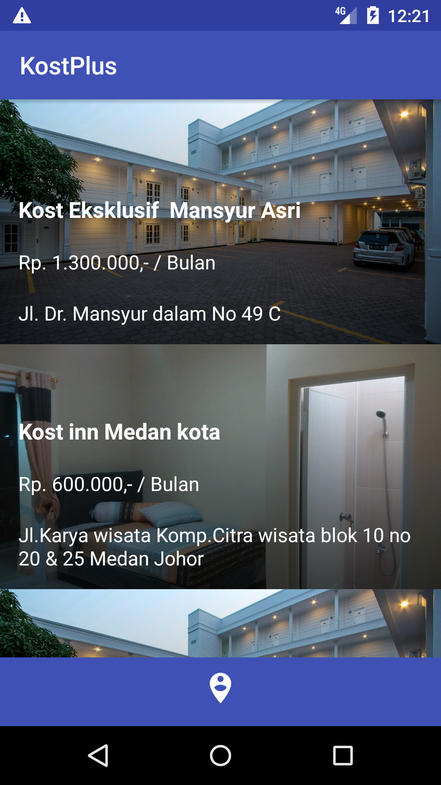
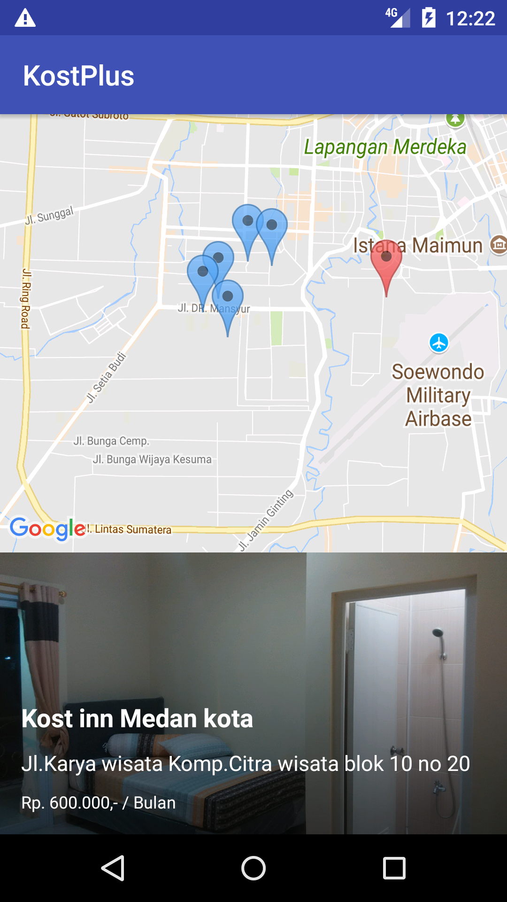
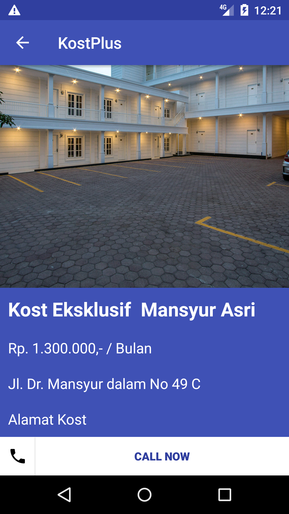

# KostPlus
KostPlus is a mobile Android application sample for Indonesian Student Apartement called **Kost** this app implemented android REST API fuction and Location based system information using GoogleMap API

## Demo

  
  
  

## Requirement
<li>Web Environtment for PHP MySQL you can use XAMPP or MAMPP</li>
<li>Android Studio 2.3 or latest</li>
<li>Basic PHP Knowledge</li>
<li>Basic Java Knowledge</li>

## Add GoogleMap API for your android project 
for the map feature you must implement Google Map API to Android Studio project you can learn from this youtube link : 
https://www.youtube.com/watch?v=qIRLBbiqtcM

#### Made with &#9829;
Follow me on instagram :)
- [@iqbalhood](https://instagram.com/iqbalhood)

### Contribution Process

1. Submit an issue describing your proposed change to the repo in question.
1. The repo owner will respond to your issue promptly.
1. Fork the desired repo, develop and test your code changes.
1. Ensure that your code adheres to the existing style of the library to which
   you are contributing.
1. Ensure that your code has an appropriate set of unit tests which all pass.
1. Submit a pull request and cc @iqbal09
